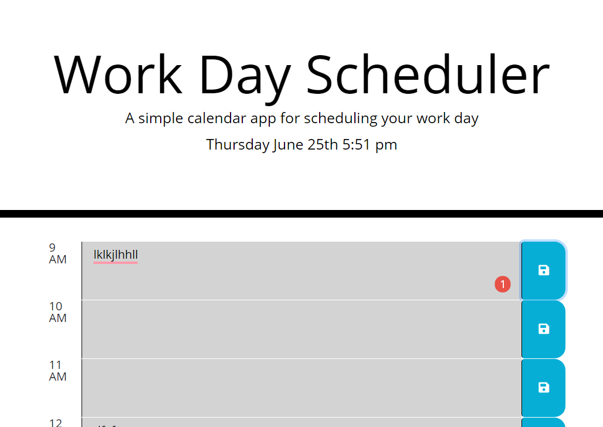

# Work Day Scehduler

This is the work day scheduler we had to create for homework #5.

Deployed app: https://tmylesc.github.io/homework5/

It involves inputting schedule details into hour blocks and saving them to local storage. The background color of the schedule blocks depends on the hour of the day to show if it is past, present, or future.

